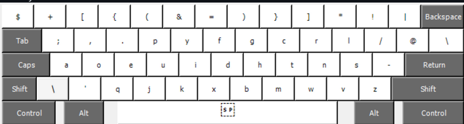
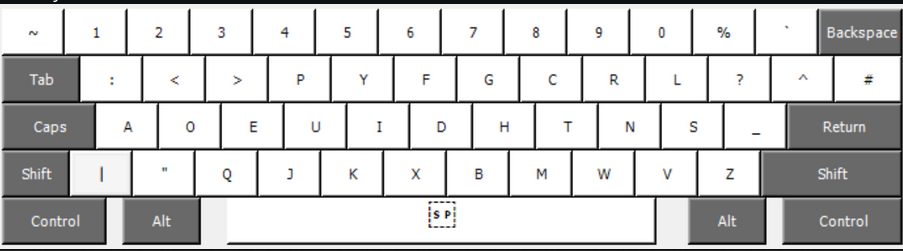

Big thanks to ThePrimegen for getting us to know about Dvorak.

# Eazy setup for the costum "Real Programmer Dvorak" XKB Layout for Linux, the one the primegen used from the primegen github turned into an xkb

This is dvorak but just the numbers `1234567890-= which have the following symbols ~!@#$%^&*()_+ have been modified to have the symbols $+[{(&=)}]*!|. 

This repository contains the keyd/default.conf configuration and XKB symbol file for the "Real Programmer Dvorak" keyboard layout, configured for Linux systems. 

The keyboard can be found in https://github.com/ThePrimeagen/keyboards

Here is the keyboard picture bellow with and without shift:

The real programmer dvorak **withiout shift**:



( yes I get it if you need numbers you hit shift+symbol it's meant that way )

wThe real programmer dvorak **with shift**:




( if you don't like how it's meant, use keyd to bypass the limit and add more ergonomic flixable solutions, My personal customized version of The Real Programmer Dvorak is all in my huge keyd config that has more than 2k configs. If you are interested check it out in gitdexgit/arch_dex)

## There are many ways to get this but here are the best 2 ways you can achieve this:


1) If you are on wayland or you are a person who has many xbindkeys and keyboard shortcuts I advise you
to use keyd. Pleas read keyd github. I think the best solution regardless is keyd. I advise you to use keyd.
everything you need is in /etc/keyd/default.conf just 1 file. copy it to your /etc/keyd/default.conf

### (Recommended) for keyd installation

#### gitting keyd

1) visit keyd github -->  https://github.com/rvaiya/keyd

2) install and run keyd


## Installation

0. **Download**

    Git clone the repo

    ```bash
    git clone https://github.com/gitdexgit/keyboard.git dvorak
    ```

    Cd in to the files needed for this layout 

    ```bash
    cd dvorak
    ```

1. **(Optional) A good practice is to backup any keyd config**

    ```bash
    sudo cp /etc/keyd/default.conf /etc/keyd/default.conf.bak
    ```


2.  **Copy the /etc/keyd/default.conf File**

    Copy the `us_rpd` file from this repository to the system's XKB symbols directory.

    ```bash
    sudo cp /etc/keyd/default.conf /etc/keyd/
    ```

3. **Reload config**

    Open terminal and run 

    ```bash
    keyd reload
    ```


# (Not recommended) xkb dvorak setup

The primary goal here is to have a single, self-contained file that can be easily deployed on a new system without modif modfying complex system XML rules or installing anything, making it a robust and portable solution. on all linux X11 OSs.


---

## Installation

0. **Download**

    Git clone the repo

    ```bash
    git clone https://github.com/gitdexgit/keyboard.git dvorak
    ```

    Cd in to the files needed for this layout 

    ```bash
    cd dvorak
    ```


1.  **Copy the Layout File**

    Copy the `us_rpd` file from this repository to the system's XKB symbols directory.

    ```bash
    sudo cp us_rpd /usr/share/X11/xkb/symbols/
    ```

2.  **Activate the Layout**

    Apply the layout using `setxkbmap`. Your keyboard should immediately change.

    ```bash
    setxkbmap us_rpd
    ```

    To switch back to the standard US QWERTY layout, run:
    ```bash
    setxkbmap us
    ```

## Aliases

To make the switching seemless you can create you own aliases in your .zshrc or .bashrc:

for me I have the following alias: 

```bash
alias \00.='setxkbmap -layout us'
alias \01.='setxkbmap -layout fr'
alias \04.='setxkbmap us_rpd'
```
